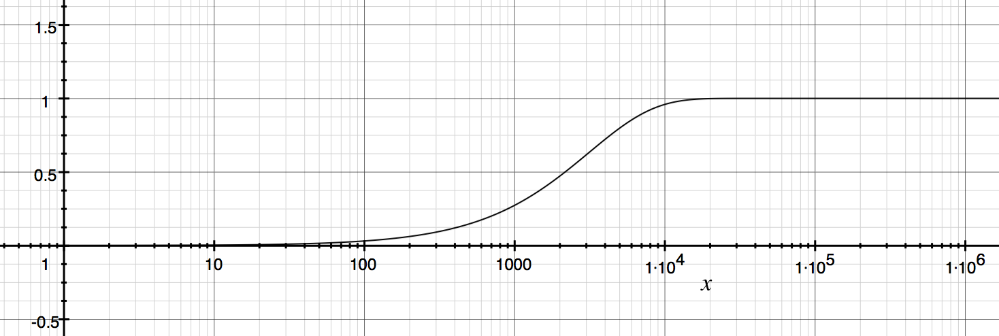

# サイゼリヤで学ぶシェル芸

## 第31回シェル芸勉強会 大阪サテライトLT
## 2017/10/8
## so

>>>

- [スライド](https://horo17.github.io/saizeriya-challenge/)

>>>

## `$ whoami`


* so ([@3socha](https://twitter.com/3socha))
* インフラエンジニア (AWS/Azure)

---

## 経緯

- <blockquote class="twitter-tweet" data-lang="ja"><p lang="ja" dir="ltr">明日シェル芸大阪サテライト組の方々とごはん行くことになったので、興味のある変態の方はDMください。梅田近辺になるとか、ならないとか。</p>&mdash; キュアぐれさん (@grethlen) <a href="https://twitter.com/grethlen/status/912628859694080000?ref_src=twsrc%5Etfw">2017年9月26日</a></blockquote>

- <blockquote class="twitter-tweet" data-lang="ja"><p lang="ja" dir="ltr">そうか、お店分からないけど<a href="https://twitter.com/hashtag/saizeriya_meetup?src=hash&amp;ref_src=twsrc%5Etfw">#saizeriya_meetup</a> つけてサイゼリアで食えばよいのか。。。</p>&mdash; キュアぐれさん (@grethlen) <a href="https://twitter.com/grethlen/status/912629630439276544?ref_src=twsrc%5Etfw">2017年9月26日</a></blockquote>

- 数名のシェル芸人とサイゼリヤで 🍕

>>>

## [#saizeriya_meetup](https://twitter.com/hashtag/saizeriya_meetup?src=hash)

- [エンジニアがサイゼリヤに行くとこうなる](https://togetter.com/li/1138341)
- 財布にやさしいイタリア料理店

>>>

## ちなみに

- サイゼリアではなくサイゼリ**ヤ**
- <blockquote class="twitter-tweet" data-lang="ja"><p lang="ja" dir="ltr">サイゼリアじゃなくてサイゼリヤと初めて認識した</p>&mdash; eban (@eban) <a href="https://twitter.com/eban/status/912677615797809152?ref_src=twsrc%5Etfw">2017年9月26日</a></blockquote>

---

## サイゼリヤチャレンジ

- <blockquote class="twitter-tweet" data-lang="ja"><p lang="ja" dir="ltr">shuf -er ア リ イ ゼ サ | head -n 5 | xargs<a href="https://twitter.com/hashtag/%E3%82%B7%E3%82%A7%E3%83%AB%E8%8A%B8?src=hash&amp;ref_src=twsrc%5Etfw">#シェル芸</a><a href="https://twitter.com/hashtag/%E3%82%B5%E3%82%A4%E3%82%BC%E3%83%AA%E3%82%A2%E3%83%81%E3%83%A3%E3%83%AC%E3%83%B3%E3%82%B8?src=hash&amp;ref_src=twsrc%5Etfw">#サイゼリアチャレンジ</a></p>&mdash; キュアぐれさん (@grethlen) <a href="https://twitter.com/grethlen/status/912630682047856640?ref_src=twsrc%5Etfw">2017年9月26日</a></blockquote>
- <blockquote class="twitter-tweet" data-lang="ja"><p lang="ja" dir="ltr">リ イ ア リ ゼ <a href="https://t.co/d9JZXL1bAm">https://t.co/d9JZXL1bAm</a></p>&mdash; シェル芸bot (@minyoruminyon) <a href="https://twitter.com/minyoruminyon/status/912630687043174400?ref_src=twsrc%5Etfw">2017年9月26日</a></blockquote>
- シェル芸人のおもちゃになるサイゼリヤ (文字列)

>>>

## [#サイゼリヤチャレンジ](https://twitter.com/hashtag/%E3%82%B5%E3%82%A4%E3%82%BC%E3%83%AA%E3%83%A4%E3%83%81%E3%83%A3%E3%83%AC%E3%83%B3%E3%82%B8?src=hash)の本来の意味

- [1人でサイゼリヤに行き胃袋に無理のない範囲で飲食をし会計を2000円以上にする『サイゼリヤ2000円チャレンジ』に挑戦してみよう](https://togetter.com/li/1133393)

>>> 

## そんなことは知ったこっちゃないシェル芸人達

- <blockquote class="twitter-tweet" data-lang="ja"><p lang="ja" dir="ltr">echo サイゼリヤ | sed &#39;s/./&amp; /g&#39; | xargs shuf -e | tr -d &#39;\n&#39; | xargs<a href="https://twitter.com/hashtag/%E3%82%B5%E3%82%A4%E3%82%BC%E3%83%AA%E3%82%A2%E3%83%81%E3%83%A3%E3%83%AC%E3%83%B3%E3%82%B8?src=hash&amp;ref_src=twsrc%5Etfw">#サイゼリアチャレンジ</a><a href="https://twitter.com/hashtag/%E3%82%B7%E3%82%A7%E3%83%AB%E8%8A%B8?src=hash&amp;ref_src=twsrc%5Etfw">#シェル芸</a></p>&mdash; くんすと@内田彩10/14 (@kunst1080) <a href="https://twitter.com/kunst1080/status/912632789299732481?ref_src=twsrc%5Etfw">2017年9月26日</a></blockquote>
- <blockquote class="twitter-tweet" data-lang="ja"><p lang="ja" dir="ltr">ヤリサゼイ <a href="https://t.co/4nlEsq2INr">https://t.co/4nlEsq2INr</a></p>&mdash; シェル芸bot (@minyoruminyon) <a href="https://twitter.com/minyoruminyon/status/912632793741455361?ref_src=twsrc%5Etfw">2017年9月26日</a></blockquote>

>>>

## リゼアアゼ
- <blockquote class="twitter-tweet" data-lang="ja"><p lang="ja" dir="ltr">node -e &quot;[...Array(5)].forEach(() =&gt; console.log(&#39;サイゼリア&#39;.split(&#39;&#39;)[Math.floor(Math.random()*10)%5]))&quot; <a href="https://twitter.com/hashtag/%E3%82%B7%E3%82%A7%E3%83%AB%E8%8A%B8?src=hash&amp;ref_src=twsrc%5Etfw">#シェル芸</a></p>&mdash; ぷる@無職 (@butackle66) <a href="https://twitter.com/butackle66/status/912641802561216513?ref_src=twsrc%5Etfw">2017年9月26日</a></blockquote>
- <blockquote class="twitter-tweet" data-lang="ja"><p lang="ja" dir="ltr">リ<br>ゼ<br>ア<br>ア<br>ゼ <a href="https://t.co/HQvG43dHqk">https://t.co/HQvG43dHqk</a></p>&mdash; シェル芸bot (@minyoruminyon) <a href="https://twitter.com/minyoruminyon/status/912641815014121472?ref_src=twsrc%5Etfw">2017年9月26日</a></blockquote>

>>>

## アゼリサゼ

- <blockquote class="twitter-tweet" data-lang="ja"><p lang="ja" dir="ltr">echo アイサゼリ | zsh -c &#39;read x;repeat $<a href="https://twitter.com/hashtag/x?src=hash&amp;ref_src=twsrc%5Etfw">#x</a> echo -n <a href="https://twitter.com/search?q=%24x&amp;src=ctag&amp;ref_src=twsrc%5Etfw">$x</a>[RANDOM%$<a href="https://twitter.com/hashtag/x?src=hash&amp;ref_src=twsrc%5Etfw">#x</a>+1];echo&#39;<a href="https://twitter.com/hashtag/%E3%82%B7%E3%82%A7%E3%83%AB%E8%8A%B8?src=hash&amp;ref_src=twsrc%5Etfw">#シェル芸</a><a href="https://twitter.com/hashtag/%E3%82%B5%E3%82%A4%E3%82%BC%E3%83%AA%E3%82%A2%E3%83%81%E3%83%A3%E3%83%AC%E3%83%B3%E3%82%B8?src=hash&amp;ref_src=twsrc%5Etfw">#サイゼリアチャレンジ</a></p>&mdash; eban (@eban) <a href="https://twitter.com/eban/status/912659644371288065?ref_src=twsrc%5Etfw">2017年9月26日</a></blockquote>
- <blockquote class="twitter-tweet" data-lang="ja"><p lang="ja" dir="ltr">アゼリサゼ <a href="https://t.co/6Pd7ooqTN2">https://t.co/6Pd7ooqTN2</a></p>&mdash; シェル芸bot (@minyoruminyon) <a href="https://twitter.com/minyoruminyon/status/912659649773502465?ref_src=twsrc%5Etfw">2017年9月26日</a></blockquote>

>>>

## 朝ゼリー

- <blockquote class="twitter-tweet" data-lang="ja"><p lang="ja" dir="ltr">ruby -e &quot;puts &#39;アイサゼリ&#39;.split(&#39;&#39;).sample(5).join&quot; <a href="https://twitter.com/hashtag/%E3%82%B7%E3%82%A7%E3%83%AB%E8%8A%B8?src=hash&amp;ref_src=twsrc%5Etfw">#シェル芸</a> <a href="https://twitter.com/hashtag/%E3%82%B5%E3%82%A4%E3%82%BC%E3%83%AA%E3%82%A2%E3%83%81%E3%83%A3%E3%83%AC%E3%83%B3%E3%82%B8?src=hash&amp;ref_src=twsrc%5Etfw">#サイゼリアチャレンジ</a></p>&mdash; so (@3socha) <a href="https://twitter.com/3socha/status/912631745840791553?ref_src=twsrc%5Etfw">2017年9月26日</a></blockquote>
- <blockquote class="twitter-tweet" data-lang="ja"><p lang="ja" dir="ltr">アサゼリイ <a href="https://t.co/4LcBlnY7Fu">https://t.co/4LcBlnY7Fu</a></p>&mdash; シェル芸bot (@minyoruminyon) <a href="https://twitter.com/minyoruminyon/status/912631750563471361?ref_src=twsrc%5Etfw">2017年9月26日</a></blockquote>

>>>

## ヤサリゼイ

- <blockquote class="twitter-tweet" data-lang="ja"><p lang="ja" dir="ltr">echo &quot;サイゼリヤ&quot; |grep -o . |sort -s |shuf |xargs |tr -d &quot; &quot; |tee &gt;(grep &quot;サイゼリヤ&quot; &amp;&amp; echo &quot;せいこう&quot; || echo &quot;しっぱい&quot; )<a href="https://twitter.com/hashtag/%E3%82%B7%E3%82%A7%E3%83%AB%E8%8A%B8?src=hash&amp;ref_src=twsrc%5Etfw">#シェル芸</a><a href="https://twitter.com/hashtag/%E3%82%B5%E3%82%A4%E3%82%BC%E3%83%AA%E3%82%A2%E3%83%81%E3%83%A3%E3%83%AC%E3%83%B3%E3%82%B8?src=hash&amp;ref_src=twsrc%5Etfw">#サイゼリアチャレンジ</a></p>&mdash; むっつー (@mutz0623) <a href="https://twitter.com/mutz0623/status/912661667946815488?ref_src=twsrc%5Etfw">2017年9月26日</a></blockquote>
- <blockquote class="twitter-tweet" data-lang="ja"><p lang="ja" dir="ltr">ヤサリゼイ<br>しっぱい <a href="https://t.co/1cPyiqH7sm">https://t.co/1cPyiqH7sm</a></p>&mdash; シェル芸bot (@minyoruminyon) <a href="https://twitter.com/minyoruminyon/status/912661673202163713?ref_src=twsrc%5Etfw">2017年9月26日</a></blockquote>

>>>

## ヤサイゼリー

- <blockquote class="twitter-tweet" data-lang="ja"><p lang="ja" dir="ltr">echo-sd ヤサイゼリー <a href="https://twitter.com/hashtag/%E3%82%B7%E3%82%A7%E3%83%AB%E8%8A%B8?src=hash&amp;ref_src=twsrc%5Etfw">#シェル芸</a> <a href="https://twitter.com/hashtag/%E3%82%B5%E3%82%A4%E3%82%BC%E3%83%AA%E3%83%A4%E3%83%81%E3%83%A3%E3%83%AC%E3%83%B3%E3%82%B8?src=hash&amp;ref_src=twsrc%5Etfw">#サイゼリヤチャレンジ</a> <a href="https://twitter.com/hashtag/%E3%81%97%E3%81%A6%E3%81%AA%E3%81%84?src=hash&amp;ref_src=twsrc%5Etfw">#してない</a></p>&mdash; Ryuichi Ueda (@ryuichiueda) <a href="https://twitter.com/ryuichiueda/status/912664470878437376?ref_src=twsrc%5Etfw">2017年9月26日</a></blockquote>
- <blockquote class="twitter-tweet" data-lang="ja"><p lang="ja" dir="ltr">＿人人人人人人人人＿<br>＞　ヤサイゼリー　＜<br>￣Y^Y^Y^Y^Y^Y^Y^Y^￣ <a href="https://t.co/Uws48KPt6x">https://t.co/Uws48KPt6x</a></p>&mdash; シェル芸bot (@minyoruminyon) <a href="https://twitter.com/minyoruminyon/status/912664476121391104?ref_src=twsrc%5Etfw">2017年9月26日</a></blockquote>

---

## ちょっと気になった

- どれくらいチャレンジしたらサイゼリヤに行くことができるだろうか

```sh
$ echo ヤサイゼリ | grep -o . | shuf -r | head -5 | tr -d '\n'
```

- 異なる5文字から1文字ずつ5回取り出す
- それぞれの試行は独立

>>>

## 計算


```sh
$ printf '%.5f' $(echo 'scale=5; 1/5^5' | bc)
0.00032
```

```sh
$ seq 0 5 | awk 'BEGIN{print "x\tP(x)\n------- -------"}
  {print 10^$1"\t"1-(1-1/5^5)^10^$1}'
x       P(x)
------- -------
1       0.00032
10      0.0031954
100     0.0314984
1000    0.273888
10000   0.959259
100000  1
```

>>>

## グラフ (手抜き)



---

## やってみる

```
$ echo ヤサイゼリ | grep -o . | shuf -r |\
  tr -d '\n' | fold -w15 | head -n 5
リイヤリサ
ゼイリゼゼ
ヤサヤゼサ
リリイサリ
ゼゼゼリサ
```

>>>

## 最初に一致した時の行番号

```
$ echo ヤサイゼリ | grep -o . | shuf -r |\
  tr -d '\n' | fold -w15 |\
  awk '/サイゼリヤ/{print NR}' | head -n 1
3504
```

- `awk` の `NR` でマッチした時の行番号を出力してみた

>>>

## 疑問

- 何故かコマンドの完了が遅い
- たまに止まらずに暴走している?
- `awk` の出力バッファの影響?

```
$ echo ヤサイゼリ | grep -o . | shuf -r |\
  tr -d '\n' | fold -w15 |\
  awk '/サイゼリヤ/{print NR; fflush()}' | head -n 1
5728
```

- `fflush()` で行番号の出力は早くなったけど、コマンドの完了は遅いまま
- `head` は実行完了して `|` の出力は塞がってそうだけど、`awk` がそれを認識していない?

>>>

## よくわからん

```
$ echo-sd --tanzaku 教えてシェル芸人
┏-┷-┓
┃ 教 ┃
┃ え ┃
┃ て ┃
┃ シ ┃
┃ ェ ┃
┃ ル ┃
┃ 芸 ┃
┃ 人 ┃
┗━━┛
```

---


## サイゼリヤ meetup で聞いてみました

- `awk` が `SIGPIPE` を受け取っていないのは合っていそう
- 以前のシェル芸勉強会でも話題になったらしい
- [AWK 本](https://www.amazon.co.jp/dp/4798150916)に載ってるよ
- `grep -m` 使えば良いよ

>>>

## サイゼリヤでシェル芸

- <blockquote class="twitter-tweet" data-partner="tweetdeck"><p lang="ja" dir="ltr">まさかサイゼで <a href="https://twitter.com/hashtag/%E3%82%B7%E3%82%A7%E3%83%AB%E8%8A%B8?src=hash&amp;ref_src=twsrc%5Etfw">#シェル芸</a> のリファクタリング大会が始まるとはw</p>&mdash; nmrmsys (@nmrmsys) <a href="https://twitter.com/nmrmsys/status/912996585721622529?ref_src=twsrc%5Etfw">September 27, 2017</a></blockquote>

>>>

## できた

- <blockquote class="twitter-tweet" data-lang="ja"><p lang="ja" dir="ltr">echo イサゼヤリ | grep -o . | shuf -r | tr -d \\n | fold -w 15 | nl | grep -m1 サイゼリヤ | awk &#39;{print $1}&#39; <a href="https://twitter.com/hashtag/%E3%82%B7%E3%82%A7%E3%83%AB%E8%8A%B8?src=hash&amp;ref_src=twsrc%5Etfw">#シェル芸</a> <a href="https://twitter.com/hashtag/%E3%82%B5%E3%82%A4%E3%82%BC%E3%83%AA%E3%83%A4%E3%83%81%E3%83%A3%E3%83%AC%E3%83%B3%E3%82%B8?src=hash&amp;ref_src=twsrc%5Etfw">#サイゼリヤチャレンジ</a></p>&mdash; so (@3socha) <a href="https://twitter.com/3socha/status/913033838946689024?ref_src=twsrc%5Etfw">2017年9月27日</a></blockquote>

- <blockquote class="twitter-tweet" data-lang="ja"><p lang="und" dir="ltr">611 <a href="https://t.co/rhV0UbTy5J">https://t.co/rhV0UbTy5J</a></p>&mdash; シェル芸bot (@minyoruminyon) <a href="https://twitter.com/minyoruminyon/status/913033844172800001?ref_src=twsrc%5Etfw">2017年9月27日</a></blockquote>

>>>

```
$ echo ヤサイゼリ | grep -o . | shuf -r |\
  tr -d '\n' | fold -w15 |\
  nl | grep -m1 サイゼリヤ | awk '{print $1}'
8474
```

- `nl` で行番号付与
- `grep -m1` で 1 回マッチしたら終了
- `awk` に渡るのは 1 行のみ

>>>

## 補足

- `${PIPESTATUS[@]}` でパイプで繋いだ各コマンドの終了ステータスがわかる

```
$ echo ヤサイゼリ | grep -o . | shuf -r |\
  tr -d '\n' | fold -w15 |\
  awk '/サイゼリヤ/{print NR}' | head -n 1
1736
$ echo ${PIPESTATUS[@]}
0 0 141 141 141 2 0
```

- 141 は `SIGPIPE` (13) を受け取って終了
- `man bash` より 

> The return value of a simple command is its exit status, or 128+n if the command is terminated by signal n.

---

## まとめ

- シェル芸人すごい
    - コマンドオプションの組み合わせ方、記号類は検索しづらい
    - <blockquote class="twitter-tweet" data-lang="ja"><p lang="ja" dir="ltr">スーパーシェル芸人に昨日のサイゼリヤチャレンジで分からなかったところを聞いて見たら一瞬で解決した、すごい。</p>&mdash; so (@3socha) <a href="https://twitter.com/3socha/status/912996769272709121?ref_src=twsrc%5Etfw">2017年9月27日</a></blockquote>
    - ありがとうございます
- サイゼリヤすごい
    - とてもリーズナブルでおなかいっぱいに

>>>

## 追記

- ...という LT をしたら、早速追加の知見を頂いたので追記
    - ありがとうございます
- <blockquote class="twitter-tweet" data-partner="tweetdeck"><p lang="ja" dir="ltr">headをむりやりラインバッファモードにする手もある<br>echo ヤサイゼリ | grep -o . | shuf -r | tr -d &#39;\n&#39; | fold -w15 | awk &#39;/サイゼリヤ/{print NR}&#39; | stdbuf -oL head -n1<br># シェル芸</p>&mdash; eban (@eban) <a href="https://twitter.com/eban/status/916582296680988673?ref_src=twsrc%5Etfw">October 7, 2017</a></blockquote>
- <blockquote class="twitter-tweet" data-lang="ja"><p lang="ja" dir="ltr">awkでexitする手もある <a href="https://twitter.com/hashtag/%E3%82%B7%E3%82%A7%E3%83%AB%E8%8A%B8?src=hash&amp;ref_src=twsrc%5Etfw">#シェル芸</a></p>&mdash; みどりごけ@FE勉強中 (@midokokemaru) <a href="https://twitter.com/midokokemaru/status/916581617610629121?ref_src=twsrc%5Etfw">2017年10月7日</a></blockquote>

---

## おしらせ

- [シェル芸勉強会 meets バイオインフォマティクス vol.1](https://bio-shell.connpass.com/event/66089/)
    - 2017/10/18 (水) 19:00-21:30 @東京
    - <blockquote class="twitter-tweet" data-conversation="none" data-cards="hidden" data-partner="tweetdeck"><p lang="ja" dir="ltr">気付いたらもう満員になってますね。<br>この勢いではバイオ勢が大阪サテライトを作るのも時間の問題です。その前に本家は海外にサテライト作るくらいじゃないと。。。</p>&mdash; キュアぐれさん (@grethlen) <a href="https://twitter.com/grethlen/status/904709186499391488?ref_src=twsrc%5Etfw">September 4, 2017</a></blockquote>
- [バイオシェル芸勉強会　大阪公聴会](https://atnd.org/events/91434)
    - 大阪サテライト会場用意してもらいました

>>>

## おまけ

- バイオシェル芸...ってこういうこと?

```
$ while :;do echo;sleep 0.1;done | awk '{a=sin(NR/3)*5+5;b=10-a;for(i=1;i<((a<b)?a:b);i++)printf " ";printf (sqrt((a-b)^2)<1.5)?"":(a<b)?"🍚":"🐟";for(i=i;i<((a<b)?b:a);i++)printf " ";print (sqrt((a-b)^2)<1.5)?"🍣":(a>b)?"🍚":"🐟"}'
```
